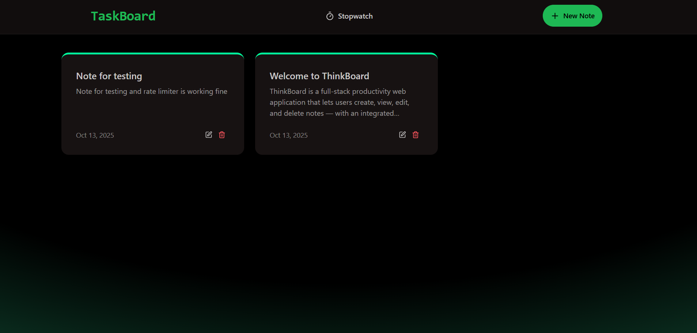
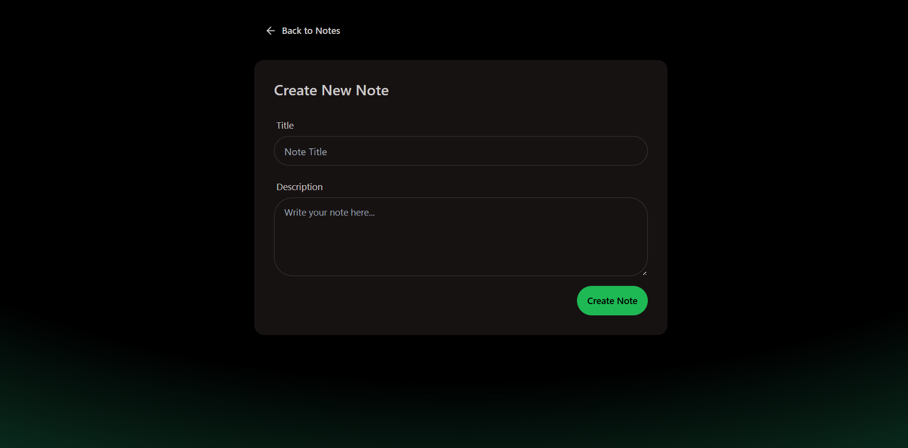
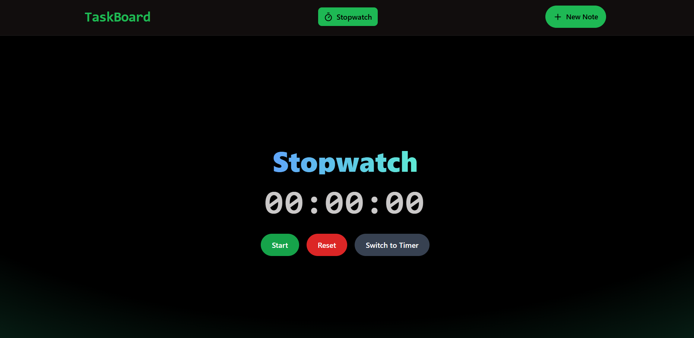

<!-- <h1 align="center">📝 Note taking application with js frameworks</h1>

Highlights:

- 🧱 Full-Stack App Built with the MERN Stack (MongoDB, Express, React, Node)
- ✨ Create, Update, and Delete Notes with Title & Description
- 🛠️ Build and Tested a Fully Functional REST API for a notes application
- ⚙️ Rate Limiting with Upstash Redis — a Real-World Concept Explained Simply
- 🚀 Completely Responsive UI


## 🔧 Run the Backend

```
cd backend
npm install
npm run dev
```

## 💻 Run the Frontend

```
cd frontend
npm install
npm run dev
``` -->
# 🧠 TaskBoard

**TaskBoard** is a full-stack productivity web application that lets users create, view, edit, and delete notes — with an integrated stopwatch to track focus or study sessions.  
It also includes a **rate-limiting system** powered by **Upstash Redis** to prevent excessive requests and keep the app smooth and reliable.

---

## 🚀 Features

- 📝 **Notes Management** – Create, update, delete, and view your notes.  
- ⏱️ **Stopwatch** – Track your work or study time within the app.  
- ⚡ **Rate Limiting** – Prevent spamming or flooding requests using **Upstash Redis**.  
- 🌙 **Modern Dark UI** – Responsive and elegant design built with **React + Tailwind CSS**.  
- 🗄️ **Persistent Storage** – Notes are securely stored in **MongoDB** via Express backend.

---
## 🖼️ UI Preview

### 🗒️ Notes Dashboard


### 📝 Create Note


### ⏱ Starting Stopwatch/Timer


<!-- ### 🚫 Rate Limit Message
 -->

---

## 🏗️ Tech Stack

**Frontend**
- React.js  
- Tailwind CSS  

**Backend**
- Node.js  
- Express.js  
- MongoDB (Mongoose)  
- Upstash Redis (for rate limiting)

---

## ⚙️ Setup Instructions

### 1️⃣ Clone the Repository
```bash
git clone https://github.com/<your-username>/TaskBoard.git
cd ThinkBoard
```

### 2️⃣ Install Dependencies
Install dependencies in both client and server folders:
```bash
npm install
```

### 3️⃣ Environment Variables

Create a .env file inside the server directory:
```bash
MONGO_URI=<your-mongodb-connection-string>
UPSTASH_REDIS_REST_URL=<your-upstash-redis-url>
UPSTASH_REDIS_REST_TOKEN=<your-upstash-redis-token>
PORT=5000
```

### 4️⃣ Run the App

 Run both servers:

**Backend**
```bash
cd server
npm run dev
```

**Frontend**
```bash
cd client
npm start

```

---

Now open http://localhost:{process.env.PORT}
 to view the app.

---
 ## 🧩 API Routes Overview

|   Method   | Endpoint         | Description             |
| :--------: | :--------------- | :---------------------- |
|   **GET**  | `/api/notes`     | Fetch all notes         |
|  **POST**  | `/api/notes`     | Create a new note       |
|   **PUT**  | `/api/notes/:id` | Update an existing note |
| **DELETE** | `/api/notes/:id` | Delete a note           |

---

## 🔮 Future Enhancements

### ->🔐 User authentication (JWT or OAuth)

### -> 🪶 Rich text editor for notes

### ->🗂️ Note categories & tags

### ->☁️ Cloud storage for backups

### ->📊 Stopwatch session history


